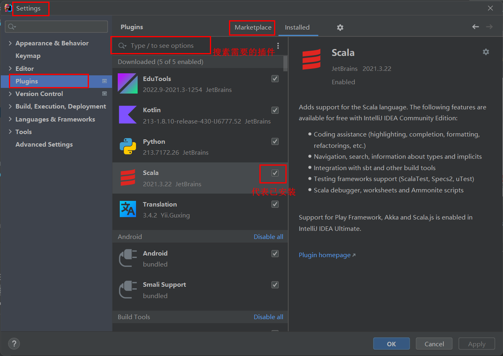

# idea环境配置

---
 

## 设置缩放字体快捷键

---

 

## 配置 Scala 环境
> 1、下载安装Scala
>> Scala官网下载
>>>
>
> ---
>
> 2、配置环境变量
> 
> ---
> 
> 3、idea中安装Scala插件
>>
> 
> ---
> 
> 4、引入scala 框架
>>
>
>  ---
>
> 5、创建Scala源目录
>> 
> 
> ---
> 
> 6、添加ScalaSDK，否则会报找不到或无法加载主类
>>
> 
> ---
>
> 7、创建Scala文件
> 

 

---

 

## Python环境
>1、下载python插件（和Scala步骤一样）
> 
> ---
> 
> 2、引入python框架（和Scala步骤一样）
> 
> ---
> 
> 3、下载 pyspark 和 findspark
>> pip install pyspark==2.3.2 (指定pyspark的版本)
> 
>>pip install findspark 
>>> 问题
>>>>不初始化会报错（py4j.protocol.Py4JError: org.apache.spark.api.python.PythonUtils.isEncryptionEnabled does not exist in the JVM） 
>>>
>>> 解决
>>>> findspark.init()
>   
> 作用就是初始化找到本机安装的spark的环境

