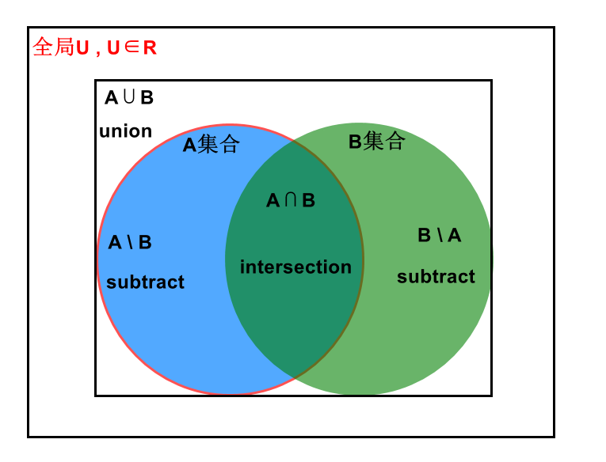

# union 并集

---

 

### 官网
| Scala                                         |翻译|python|翻译|
|-----------------------------------------------|---|----|----|
|Return a new dataset that contains the union of the elements in the source dataset and the argument.|（官方直译真不好理解QAQ）返回一个新的数据集，它包含在源数据集的和参数的元素连接。| Return the union of this RDD and another one. |返回这个RDD和另一个RDD的并集。|

### 分析

### 区别
|      | Scala | python |
|------|-------|--------|
| 数据类型 | 相同    | 可以不相同  |

### 总结
- union是一种**外连接**，前提是前后两个RDD类型是相同的，才可以连
- 
