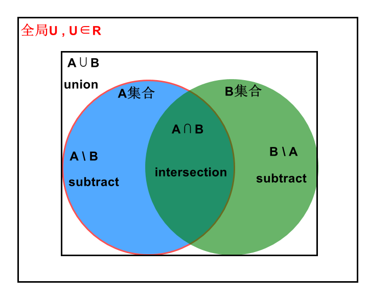

# intersection 交集

----

 

### 官网
| Scala                                                                                                | 翻译 | python | 翻译  |
|------------------------------------------------------------------------------------------------------|---|--------|-----|
| 	Return a new RDD that contains the intersection of elements in the source dataset and the argument. | （官方直译真不好理解QAQ）返回一个新的数据集，它包含在源数据集的和参数的元素交集  |Return the intersection of this RDD and another one. The output will not contain any duplicate elements, even if the input RDDs did.|返回这个RDD和另一个RDD的交点。输出将不包含任何重复元素，即使输入rdd包含重复元素。|

 

---

### 分析

### 总结
- 两个集合中共同有的元素
- 对比union是一种外连接，intersection就是**内连接**，即交集。
- 使用intersection算子的前提也需要两个RDD类型相同，相当于找出两个RDD公有的元素。