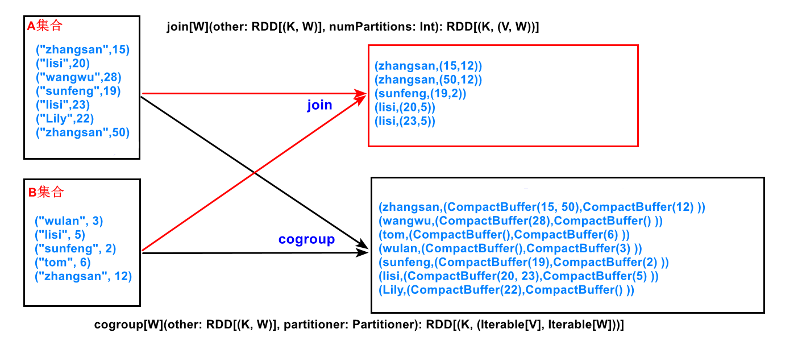

# join

-----

 

### 官网
| Scala                                                                                                                                                                                                                   | 翻译                                                                                                                      | python | 翻译  |
|-------------------------------------------------------------------------------------------------------------------------------------------------------------------------------------------------------------------------|-------------------------------------------------------------------------------------------------------------------------|--------|-----|
| 	When called on datasets of type (K, V) and (K, W), returns a dataset of (K, (V, W)) pairs with all pairs of elements for each key. Outer joins are supported through leftOuterJoin, rightOuterJoin, and fullOuterJoin. | 	在类型 （K， V） 和 （K， W） 的数据集上调用时，返回 （K， （V， W）） 对的数据集，其中包含每个键的所有元素对。通过 leftOuterJoin、rightOuterJoin 和 fullOuterJoin 支持外连接。 |Return an RDD containing all pairs of elements with matching keys in self and other.|返回一个RDD，其中包含self和other中键匹配的所有元素对。|

### 分析

### 总结
- 两个集合中找key，有相同key就输出
- 两个集合没有相同的key就忽略

