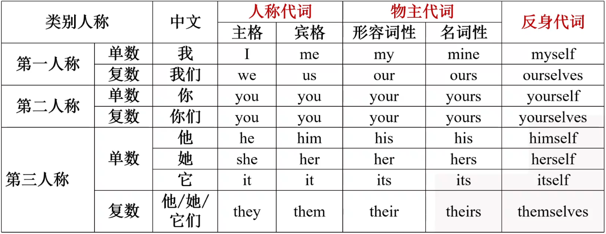
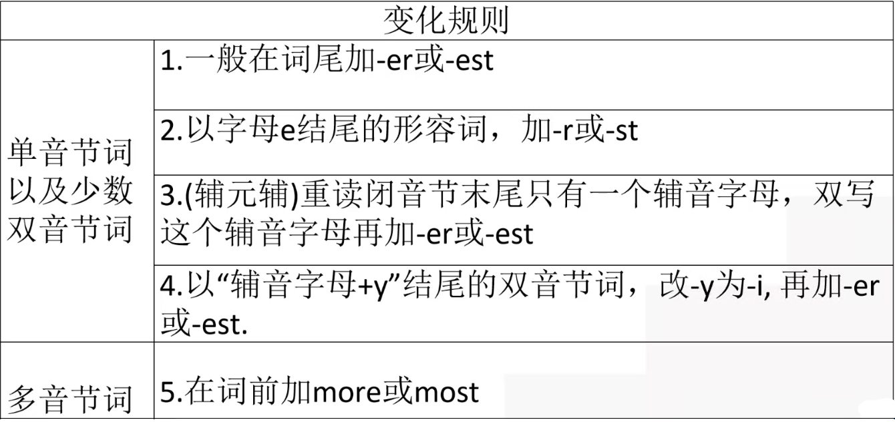
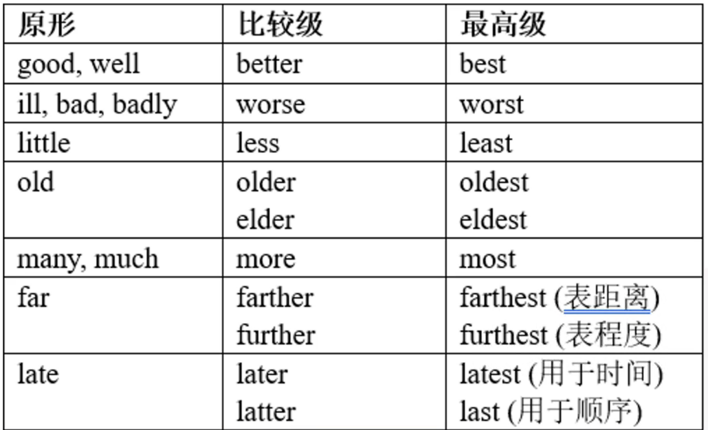
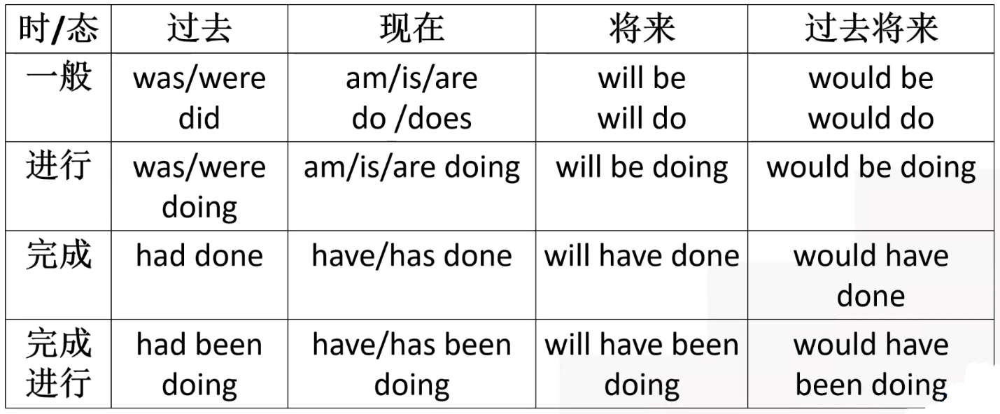

# 英语

 

## [一、语法](#grammar)

- #### 1、[名词](#noun)

- #### 2、[代词](#pronoun)

- #### 3、[冠词](#article)

- #### 4、[数词](#numeral)

- #### 5、[介词](#preposition)

- #### 6、[形容词、副词](#AdjectiveAdverb)

- #### 7、[动词](#verb)

- #### 8、[连词](#conjunction)

## [二、时态](#tense)

- ####  01、[一般现在时](#Simple present tense)

- ####  02、[一般过去时](#Simple past tense)

- #### 03、[一般将来时](#Simple future tense)

- #### 04、[过去将来时](#Past future tense)

- #### 05、[现在进行时](#Present continuous tense)

- #### 06、[过去进行时](#PastContinuousTense)

- #### 07、[将来进行时](#Future continuous tense)

- #### 08、[现在完成时](#Present perfect tense)

- #### 09、[过去完成时](#Past Perfect Tense)

- #### 10、[将来完成时](#Future Perfect Tense)

## [三、语态](#voice)

- #### 1、[被动语态](#Passive voice)

- 

## [四、主谓一致](#Subject-verb agreement)

- #### 1、

- 

## [五、倒装句](#Inverted sentences)

- #### 1、

- 

## [六、虚拟语气](#Subjunctive mood)

- #### 1、

- 

## [七、定语从句](#Determinative clause)

- #### 1、

- 

## [八、名词性从句](#Noun clause)

- #### 1、

- #### 2、

- 

## [九、状语从句](#Adverbial clause)

- #### 1、

- 

## [十、非谓语动词](#Non-predicate verbs)

- #### 1、

- 

## [十一、翻译判断](#translation)

## [十二、写作判断题](#writing)

------------------------

  

## <a id="grammar">一、语法</a>

- 词性

| 词性   | 缩写  |
| ------ | ----- |
| 名词   | n.    |
| 代词   | pran. |
| 冠词   | art.  |
| 数次   | num.  |
| 介词   | prep. |
| 形容词 | adj.  |
| 副词   | adv.  |
| 动词   | v.    |

 

### <a id="noun">1、名词</a>

（一 ）概念：表示人、事物、地点或抽象概念的词。

​			e.g  人：people（）、Mary（）、Tony（）

​				事物：book（）、pen（）

​				地点：Yunnan、Kunming、China、The Great Wall（长城）

​				抽象名词：success（成功）、belief（信念）、happiness（幸福）、hope（希望）

- 注意：名词在句中充当主语、宾语（动、介词 + 宾语）、表语（系动词 后面）等
- 抽象名词大多都不可数

（二）、分类

- **专有名词**：指人、地方、机构、组织等

  - 大多数首字母开头大写的

- **普通名词**：普通，大众化

  - 不可数名词（u.n）

  - 可数名词（c.n）

    

（三）、可数名词的单复数变化

- 一般情况在词尾加 -s

  - book——books

  - gun（枪）——guns
  - map——maps
- 以s，sh，ch，x结尾的词，在词尾加 -es

  - watch——watches
  - dish——dishes
  - box——boxes
- 以辅音字母 + y 结尾，改 y 为 i 再加 -es
- 以元音（aeiou）字母 + y 结尾，在词尾加 -s

  - baby——babies
  - toy——toys
  - city——cities
- 以o结尾的名词，有生命的加 “es”，无生命的加 “s”
  - photo（照片）——photos
  - piano（钢琴）——pianos
  - tomato（西红柿）——tomatoes
  - potato（土豆）——potatoes
  - Negro（黑人）——Negroes

- 以f、fe结尾的名词，变f、fe为v，在加 -es
  - wife（妻子）——wives
  - knife（刀）——knives
  - wolf（狼）——wolves
  - leaf（树叶）——leaves
- 中日不变英法变，其余复数加 -s
  - Chinese——China

- 补充1：常见名词单复数的**不规则变化**
  - child（孩子）——children（孩子们）
  - foot（脚）——feet
  - tooth（牙）——teeth
  - mouse（老鼠）——mice
  - man——men
  - woman——women
  - roof（屋顶）——roofs
  - 注意：由man和woman构成的合成名词，两个构成部分都要变成复数
    - man worker——men workers（男人工）
    - woman doctor—— women doctors（女医生）
- 考点1：常考的**单复数同形的名词**
  - fish（鱼）、sheep（羊）、deer（鹿）、means（方法）、works（工厂）、species（物种）等
    - To our surprise(惊讶)，there is  just a fish in the sea.
    - I will buy three fish for cooking this evening.

（四）、不可数名词：总体来讲，词义属抽象、物质、属类、学科时，多为不可数。

- 抽象名词：advice（建议）、capitalism（资本主义）、communism（共产主义）、socialism（社会主义）、happiness（幸福） 

  information（信息）、knowledge（知识）、truth（真理）、work（工作）job（工作——》可数）

- 物质名词：液体：water、气体：air、固体：iron（铁）

- 总称：furniture（家具）、jewelry（珠宝）、news（新闻）、scenery（风景）、traffic（交通）、weather（天气）、

  money（金钱）、meat（肉）、food（食物）

- 学科：biology（生物）、physics（物理）、chemistry（化学）、math（数学）

- **考点**：

  - 不可数名词没有复数形式（后面不能加  “ s/es ”）
  - u.n前一般不加 a/an
  - 不可数名词的量化
    - a piece of；一副
    - a kind of；一种
    - a cup of；一杯
  - u.n的复数体现在量词上
    - four cups of water

（五）、名词所有格

| 构成                                                         | 规则 | 例句                                             |
| ------------------------------------------------------------ | ---- | ------------------------------------------------ |
| 单数或不以 -s/ -es结尾的复数名词所有格                       | ’s   | the boy's  bag the children's  bags         |
| 以 s 结尾的复数名词的所有格                                  | ‘    | the teachers'  rooms                             |
| of  所有格（A  of B 译为 “ B的A ”）                          |      | the teacher of my son a teacher of my son's |
| A and B's  指A、B共同的...... A‘s and B's  指A、B分别的.... |      |                                                  |

 

### <a id="pronoun">2、代词</a>

#### （一）、概念：代替名词、名词性短语或句子的词

#### （二）、分类：

- 人称代词、物主代词、 反身代词、指示代词、不定代词、相互代词、 替代词one、疑问代词、连接代词和关系代词等

- 考点1：

  - 形容词性物主代词后可接名词（名词性物主代词），充当定语

  - 名词性物主代词后不可接名词（其本身相当于名词），可充当主语、宾语和表语

- 考点2：常见的句型结构：

  - to  one's(形容词性物主代词) + 情感名词（译为：“ 令某人.....的是”）  

#### （三）、指示代词

| 指示代词 | 含义               |
| -------- | ------------------ |
| this     | 这个（近指、单数） |
| these    | 这些（近指、复数） |
| that     | 那个（远指、单数） |
| those    | 那些（远指、复数） |

#### （四）、不定代词：

- 表示两者、三者相关词汇的用法 

  |            | 都   | 或者   | 都不    |
  | ---------- | ---- | ------ | ------- |
  | 两者       | both | either | neither |
  | 三者及以上 | all  | any    | none    |

  - both......and......两者都
  - either.....or.......要么.....要么.........
  - neither....not......既不........也不..........
  - all与否定词not连用时，常译为部分否定

- some + c.n/u.n 一些（肯）

- any + c.n/u.n 一些（否/疑）、任何（肯）

- 补充：“表示寻求建议、请求，且希望得到肯定回答时，疑问句中用some表示一些 ”

- many + c.n复数

- much + u.n

- few、a few、little、a little的用法区别

  | 含义         | 修饰可数名词 | 修饰 u.n |
  | ------------ | ------------ | -------- |
  | 肯：一点点   | a few        | a little |
  | 否：几乎没有 | few          | little   |

- other等相关词汇的用法

  | 词汇       | 考点                                                         |
  | ---------- | ------------------------------------------------------------ |
  | other      | 后跟复数n.                                                   |
  | others     | =other + 复数 n. ，其后不跟名词（some....，others....）      |
  | another    | 1、后跟单数名词，表示 “另一个；再一个” 2、 + 数词 / few + 复数名词 = 数词 + more + 可数名词复数表示 “ 另几个，再几个” |
  | the other  | 特指两者中的另一个 one....，the other....                    |
  | the others | 其后不跟名词，特指某一范围内 “全部或其余的人或物”            |

#### （五）复合不定代词：由some、any、every、no与thing、body、one组合而成的不定代词

>something
>
>somebody = someone
>
>anything
>
>anybody = anyone
>
>everything
>
>everybody = everyone
>
>nothing 
>
>nobody = no one

- 不定代词作主语，看成单数
- 不定代词 + adj. 

#### （六）泛指和特指

- one和ones是泛指，表示同类事物中的一个或多个，同类不同物，替代单数名词用one，替代复数名词用ones。
- it是特指前文提到的可数名词单数或不可数名词，同类同物。

 

### 3、<a id="article">冠词</a>

#### （一）作用：放在名词前的虚词（不能担当句子成分）

#### （二）分类

- 定冠词——the（特指：常译为 “ 这/那 ”）
- 不定冠词——a/an（泛指：常译为 “一.....”，单数名词前）
- 零冠词——/

#### （三）考点

- 不定冠词a/an的用法（用来表示数量 “一.......”）
  - a + 辅音音素发音的单词
  - an + 元音音素发音的单词
- 定冠词 the 的用法
  - 特指某些人或物，彼此双方都明白
  - 前面提过人或物，方位序数紧紧挨
  - 形副词的最高级，乐器江河山脉前
  - 独一无二宇宙间，普名组成专名来
  - 注意
    - 一般情况下，方位词前面有介词就加the，前面没有介词就不加the
    - 序数词、最高级前有形容词性物主代词或名词所有格修饰时不加the。
  - 补充：
    - the + 姓氏的复数表示该姓氏的一家人
    - the + adj. 表示一类人/物
- 零冠词的用法
  - 四季星期月节日
  - 三餐球类学科前
  - 补充：
    - 一般情况下以day结尾的节日不加冠词，以festival结尾的节日要加定冠词the

- 冠词的常用短语
  - 不定冠词短语
    - make a living 谋生
    - in a word 简而言之
    - all of a sudden 突然
    - catch/have a cold 感冒
    -  as a happy life 过着一个快乐的生活
  - 零冠词和定冠词的短语
    - out of question 没问题
    - out of the question 不可能
    - on earth 究竟
    - on the earth 在地球上
    - take place 发生；举行
    - take the place of 代替
    - in front of 在.......前面（外部）
    - in the front of 在......前面（内部）
    - in case 万一；以防
    - in the case of 在....的情况下

 

### 4、<a id="numeral">数词</a>

#### （一）定义：表示数量、顺序的词

#### （二）分类：

- 基数词：one、two、three、 four ..... hundred、thousand、million、 billion、trillion
- 序数词：The first/second/third/fourth

#### （三）用法

-   分数的表达式：子基在前，母序在后，分子大于1，分母加s
  - 基-序
    - One-third
    - 注意：中间横线可有可无，基数词 >=2，序数词 +s
  - 基 out of 基
    - One out of three
  - 基 in 基
    - One in three
  - 特殊的1/4的表达：a/one quarter
  - 特殊3/4的表达：three quarters = three fourths
- 单位的表达
  - 百：hundred
  - 千：thousand
  - 百万：million
  - 十亿：billion
  - 万亿：trillion
    - 一百：one hundred
    - 三千：three thousand
  - 具体数字+单位词用原形
  - 无确切的数字单位词 + s of
    - hundreds of 成百上千
    -  thousands of  成千上万
- 倍数、次数的表达方式
  - 一次 / 一倍：once
  - 两次 / 两倍：twice
    - two times只能表示两倍

  - 三次 / 三倍及以上：基数词加times
    - three times
    - four times

  - 一半：a half / one half

- in one's + 整10的基数词的复数  （在某人几十多岁的时候）

- 年龄表达的区别：
  - 基数词-year-old：做定语 + n.
  - 基数词（>1）years old：做表语

 

### 5、<a id="preposition">介词</a>

#### （一）概念：一种用来表示词与词，词与句子之间的关系的词

- 介词 + doing（v. + ing）

#### （二）分类（考点）

- 表时间的介词：
  - at + 具体时刻
  - in + 年份 / 月份 / 季节 / 不具体的某天的早中晚
  - on + 星期 / 日期 / 具体某天的早中晚
  - during + 非时间名词：在.....期间
  - over：在......期间（常用于餐饮、社交活动）
  - within + 时间名词：在......之内
- 表地点的介词：
  - at + 小地方
  - in + 大地方（城市以上）

- 表方式：
  - by + 交通工具、以......方式 / 手段（on foot 步行）
  - in + 语言 / 颜色（穿....颜色的衣服）
  - with + 有形的工具 / 身体器官 / 表伴随的含义

- 补充：
  - besides：除.......之外还有......（包含）
  - except：除......之外.........（不包括）
- 补充：
  - for表示目的 / 原因
    - 再句**首**表示目的
    - 在句**中**表示愿意
  - of表示所属 / 量化
    - 所属：“的”
    - 量化：a  pice  of
- 常见短语：
  - discourage sb. from doing sth. 使某人丧失做某事的信心；使某人邪气
  - for example 例如
  - for sale 待售
  - for free 免费
  - increase / rise to 增加到
  - increase / rise by 增加了
  - decrease / reduce to 减少到
  - decrease / reduce by 减少了

 

### 6、<a id="AdjectiveAdverb">形容词、副词</a>

#### （一）基本概念

- 形容词：描述人和事物特征的词，主要修饰**名词和代词**，可充当定语，译为 “............的”
- 副词：表示行为或状态特征的词，主要修饰**动词和形容词**，可充当状语，译为 “.........地”

#### （二）后缀

- 形容词的常用后缀
  - -able
  - -ible
  - -ous
  - -ful
  - -tive
  - -ent

- 副词的常用后缀
  - -ly

- 考点：
  - 形容词以-ed、-ing结尾的区别
    - -ed与人相关（感到.........的）
    - -ing与物相关（令人........的）

  - 特殊用法
    - developing发展中的
    - developed发达的

#### （三）原级、比较级、最高级

- 规则变化

  - 形容词的原级：adj.

  - 形容词的比较级：adj.-er、more + adj.

  - 形容词的最高级：adj.-est、most + adj.
    - tall - taller - tallest
    - nice - nicer - nicest
    - important - more important - most important
    - quickly - more quickly - most quick
    
  - 变化规则

    | 情况                     | 变化规则                          |
    | ------------------------ | --------------------------------- |
    | 单音节词以及少数双音节词 | 1、一般在词尾加—er或—est 2、 |

    

  

- 不规则变化

  

- 考点
  - 最高级用于三者及以上，比较级用于两者之间比较
  - 比较级结构：A + be + adj.比较级 + than + B
  - 可以修饰比较级的词：much / far / a lot / a little + 比较级

#### （四）固定句型

- 常用原级的句型
  - as + adj. / adv.原级 + as （和.......0一样）
  - not as / so + adj. / adv.原级 + as （前者不如后者；和.......不一样）
- 用比较级的情况
  - 基本用法：比较级 + than
  - the + 比较级，then + 比较级（越.......，就会越）
  - 比较级 + and + 比较级（单音节） （越来越..........）
  - more and  more + adj.（多音节）

- 倍数的比较
  - A + 倍数 + 比较级 + than + B 
  - A + 倍数 + as + 原级 + as + B

 

###  7、<a id="verb">动词</a>

#### （一）概念：表示主语动词或状态的词

#### （二）作用：作谓语或帮助构成谓语

#### （三）分类

- 实义动词
  - 及物动词（vt.） + 宾语
  - 不及物动词（vi.） + 介词 + 宾语
  
- 系动词：后跟形容词或名词做表语
  - be动词：be，am，is，are，was，were，been，being  + 表语
  - 表示感受的感官系动词：look，taste，smell，sound，fell + 表语
  - 变化系动词：become，grow，turn，seem，remain，keep，stay + 表语
  
- 情态动词
  - 定义：表达情感、态度、看法的动词。有一定的意义，无人称和数量的变化，与动词原形构成谓语
  - 分类：would，should，might，could，
  - 分类：  will，     shell，   may，    can，   ought to，must，need，dare    + do
  
- 考点：

  - 情态动词表推测（肯）
    - must + 动词原形：表示对**现在的肯定**推测
    - must have done ：表示对**过去的肯定**推测（一定做过某事）
  
  
    - 情态动词表推测（否）
      - can‘ t  /  couldn’ t  +  动词原形：表示对**现在的否定**推测
      - can‘ t  /  couldn’ t  +  have done ：表示对**过去的否定**推测（过去不可能做过某事）
  
  
    - 情态动词用于提问的回答：看语境
  
  
    - 对must的回答
      - 肯定回答：yes，sb  must  /  have  to
      - 否定回答：No，sb needn‘ t  /  don’ t  have  to
  

- 助动词

  - do，does，did + 动词原形（do）
  - have，has，had + 动词过去分词（done）
  - do，does，did，have，has，had也可以做实义动词
- 六种形式及其变化规则

  - 原形（do）：learn ， live， stop
  - 第三人称单数形式（does）：learns ， lives ， stops
  - 进行式（-ing）：learning， living ， stopping
  - 过去式（-ed）：leaned ， lived，stopped
  - 过去分词（-ed）：learned ， lived ， stopped

 

### 8、<a id="conjunction">连词</a>

- 并列连词
  - and：和；并且；然后（动作先后发生）
  - or：或者；否则
  - but：但是
  - yet：然而
  - while：然而
  - so：因此，所以
  - otherwise：否则
  - for：因为
- 从属连词（从句）

  

--------------

  

## <a id="tense">二、时态</a>（时间+状态）

- ” 时 “ 指不同的时间：过去、现在、将来

- ” 态 “ 指不同的动作状态：一般、进行、完成

- 

   

### 1、<a id="Simple present tense">一般现在时</a>

#### （一）定义：表示习惯性、经常性、周期性的动作或状态

#### （二）形式：do / does / am / is / are（句中有动词原形用助动词，没有动词原形用be动词）

#### （二）谓语动词形式

- 助动词
  - do：第一、二人称单数及所有人称复数形式
  - does：does（动词变复数）+ 动词原型：不可数名词、可数名词单数、第三人称单数
    - does + 动词原型：原因是因为does是do的第三人称，does已经体现了三单，所以相应动词一律改回原型
- be动词
  - am：用于第一人称单数
  - is：用于第三人称单数,没有人和物的区别
  - are：用于第二人称单数及所有人称复数形式

#### （三）口诀

- **我(I)用am，你(you)用are，is连着他(he)她(she)它(it)**
- **单数名词、不可数名词用is，复数名词全部都用are**
- **变疑问，be动词往前提，句尾问号莫丢弃**
- **变否定，更容易，be后not别忘记**

#### （四）动词变化规则（动词变化规则——》does变化）

- | 情况                                             | 规则           | 例词                                   |
  | ------------------------------------------------ | -------------- | -------------------------------------- |
  | 一般情况                                         | 加—s           | eat——eats                              |
  | 以 s，sh，ch，x，o，z 结尾的词                   | 加—es          | discuss——discusses teach——teaches |
  | 以辅音字母加 y 结尾的动词                        | 变 y 为 i + es | carry——carries fly——flies         |
  | be的变化：am；is；are have的变化：have——has |                |                                        |

#### （五）时间状语：

- always（总是）、often（经常）、usually（通常）、sometimes（有时）、 seldom（很少）、 hardly（几乎不）、 never（从不）、at times（有时）、

  every   day（每天）、 every   week（每周）、 every month（每月）、 every   year（每年）、 

  once a week（一周一次）、twice a month（一月两次）

  on Saturdays（星期六）、  

  in  the morning（在上午）、in the afternoon （在下午）、in the evening（傍晚）等

- 补充：

  - sometimes：时间
  - some times：几次
  - some time：一段时间
  - sometime：在某个时候
  - time表时间属于不可数名词
  - time表次倍属于可数名词

  - 例如
    - I like to be on my own___.
    - G. some time        H. sometime       I. some times     J. sometimes

- 表示客观真理事实、格言警句、俗语谚语，通常用一般现在时

  - Taiwan is a part of China.  台湾是中国的一部分
  - a little help brings much return. 滴水之恩当涌泉相报
  - 例如
    - He said that the sun  _rises___(rise)升起 in the east. （客观整理永不变）

 

### 2、<a id="Simple past tense">一般过去时</a>

#### （一）定义：在过去发生的动作或存在的状态

#### （二）形式：was / were / did （句中有动词原形用助动词，没有动词原形用be动词）

- be动词
  - was：用于第一、三人称单数（am / is）
  - were：用于第二人称单数及所有人称复数（are）
- 助动词
  - did：一般过去时的所有人称单复数

#### （三）规则变化

- | 情况                      | 规则              | 例词                               |
  | ------------------------- | ----------------- | ---------------------------------- |
  | 一般情况                  | 加—ed             | pack——packed                       |
  | 以辅音字母 + y 结尾的动词 | 变 y 为 i  加—ed  | carry——carried study——studied |
  | 重读闭音节                | 双写辅音字母加—ed | plan——planned stop——stopped   |
  | 以不发音的 e 结尾的动词   | 直接加—d          | like——liked                        |

#### （四）标志词（时间状语）

- yesterday（昨天）、 the  day before yesterday（前天）

   last  night（昨天晚上）、 last  week（上个星期）、 last  month（上个月）、

   时间词 + ago（...前）、 

  in 2014（in + 过去时间）、 

  just now（刚刚）、 at that time（当时）、 once（曾今）、

  the  other day（前几天）、 in  other day（在其他日子里） 、 in those days（在那些日子里）、in the past（过去）

  -  (2017真题）He  _S___  in Beijing in 2008.

    S.lived	T.lives	U.living	V.had lived

  - (2017真题）Her book   _S___ first published in 1985.

    S.was	T.were	U.had been	V.are

#### （五）used的用法

- 人做主语
  - sb. used to do sth.过去常常做某事
  - sb. be / get / become used to doing sth. 习惯于做某事

- 物作主语

  - sth. be used to do sth. 某物被用来做某事
  - sth. be used for doing sth. 某物被用来做某事
  - sth. used to be done sth.  某物过去常常被用来做某事

- (2011真题）Mile used to  _C___when he was young.

  A.swimming	B.swam	C.swim	D.to swim

- (2020真题）It  _ D_______several years for bamboo seeds to grow into plants that can be used ________commercial（商业的） purposes（目的）.

  C.costs ; to	D.takes ; for	E.costs ; for	F.takes ; to

  - 固定搭配：it takes / took sb. some time to do sth.

 

### 3、<a id="Simple future tense">一般将来时</a>

#### （一）定义：表示将来发生的动作或状态

#### （二）谓语动词形式

- will / shall  do(动词原形） ：表示将要做某事（其中，will用于所有人称，shall只能用于第一人称 I / we）
- am / is / are to do：  表示常规性的活动或注定要做的事情
- am / is / are going to do：  表示打算、计划做某事
- Am / is / are about to do：   要做或正好要做的事情
- There be （There be 不能与have / has连用）
  - There will be 
  - There is / are going to be

#### （三）用法

- | 用法       | will / shall | be going to |
  | ---------- | ------------ | ----------- |
  | 临时决定   | V            |             |
  | 主观预测   | V            |             |
  | 将来事实   | V            |             |
  | 条件句中   | V            |             |
  | 意愿、决心 | V            |             |
  | 事先计划   |              | V           |
  | 迹象表明   |              | V           |
  | 即将发生   |              | V           |

#### （四）标志词（时间状语）

- tomorrow（明天）、 soon（很快）、 tonight（今晚）、 at night（在晚上）、 before long（不久）、 right away（马上）、at once（马上）

  next month（下个月）、 next year（明年）、 

  in 2059（in + 将来时间）、 时间 + later

  in the future（在将来）、 in the nearfuture（不久的将来）、 in a few minutes（几分钟后）、in the five years（在五年内）、 in ten minutes（十分钟后）

  - （2016真题多选）He  _ GHI___（go）to Beijing next year.

    G.is goingto leave for	H.will leave for	I.is to leave for	J.left for	K.would leave for

#### （五）主将从现 

- 运用前提：在时间状语从句、条件状语从句中，主句用一般将来时，从句用一般现在时
- 时间状语从句连接词：when（当.....时候）、 while（当.....时候）、 as（）、 before（在....前）、 after（在.....后）、 till（直到） = until（直到）、 the moment (that）、 the minute (that）、 as soon as（一......就）

- 条件状语从句连接词：if（如果）、 unless（除非）、 on condition that（条件）
  - 注意：紧跟在连接词后的是从句，另一半句子为主句
  - 结构：
    - 连接词 —从句—， —主句—
    - —主句— 连接词— 从句—

 

 

### 4、<a id="Past future tense">过去将来时</a>

#### （一）定义：表示从过去某一时间看，将要发生的动作或存在的状态。常用于宾语从句

#### （二）谓语动词形式

- would（will的过去式） / should（shall的过去式） +  do(动词原形）

- was / were going to + do

- was / were to + do

- was / were about to + do

  - He said that he would wait for us at the bus stop.
  - I thought it was going to snow.
  - （2016真题）I asked him if he _was come ___（come）to our party.

  

 

### 5、<a id="Present continuous tense">现在进行时</a>

#### （一）定义：表示现在正在发生的事情或进行的动作

#### （二）谓语动词形式：主语 + am / is / are + doing（现在分词（动词的-ing形式））

#### （三）规则变化

- | 情况                           | 规则                 | 例词                           |
  | ------------------------------ | -------------------- | ------------------------------ |
  | 一般情况                       | 加—ing               | meet——meeting                  |
  | 以辅音字母结尾的重读闭音节动词 | 双写辅音字母，加—ing | stop——stopping                 |
  | 以不发音的e结尾的动词          | 去掉e，加—ing        | make——making live——living |

#### （四）标志词（时间状语）：

- 常与（right）now = at the / this moment等连用
  - Now! We_are studying__（study）English.
  - At this moment Lily _is preparing__（prepare）for the entrance examination.
  - Look! a handsome boy _ is coming__（come）here.
- 位移动词表将来：leave（离开） / arrive（到达）、 come / go、 start（出生）、 begin（出发）、 take of（起飞）f等
  - 无具体时刻 / 时间点时用 现在进行时表将来
  - 有具体时刻 / 时间点时用 一般现在时表将来
    - Dear passengers, the train _is arrivin__（arrive）.
    - The train_leaves__（leave）at six tomorrow morning
- 常见的无进行时的词
  - 感官系动词：sound（听）、 look（看）、 smell（闻）、 taste（尝）、 feel（感觉）
  - 表示事实状态的词：have（有）、 belong（属于）、 include（包含）、 contain（包含）、 continue（继续）、 remain（仍然）等
  - 表示心理或情感状态的词：realize（意识）、 think（认为）、 believe（相信）、 love（爱）、 want（想要）、 hate（讨厌）
    - The food <u>is tasting</u>（tastes） delicious.	（F）
- 现在进行时与   always（总是）、constantly（连续）、continually（继续）、forever（永远）等词连用时，往往表示说话者生气、赞扬、同情、不满、好奇等感情

 

### 6、<a id="PastContinuousTense">过去进行时</a>

#### （一）定义：表示过去某一时间正在发生或进行的动作

#### （二）谓语动词形式：was / were  doing（现在分词（动词的-ing形式））

#### （三）标志词（时间状语）：

- 具体时刻  /  从几点到几点  /  at this moment（此时此刻）  /  at this time等 + 过去时间（主要根据语境）	

  when + 过去 、 at this moment yesterday（昨天的这一刻）

  - ——What were you doing at 9 o' clock last night?	——I _  was writing __（write）a letter

  - This morning（今天早上） when I _A__ , suddenly（突然地） noise came from somewhere.

    A. was sleeping     B. slept      C.am sleeping      D. sleeps

  - They _D__ football game from 7:00 to 9:00 last night.

    A. are watching    B. watch     C. watched        D. were watching

 

### 7、<a id="Future continuous tense">将来进行时</a>

#### （一）定义：表示将来某一时间正在进行的动作

#### （二）谓语动词形式：will / shall be doing（现在分词（动词的-ing形式））

#### （三）标志词（时间状语）：

- at this moment / at this time / 具体时刻 / 从几点到几点等 + 将来时间

  - （2021年）At this time tomorrow _C___ over the Pacific

    B. we are going to fly 	c. we will be flying 	D. we will fly 	E. we are to fly 

 

### 8、<a id="Present perfect tense">现在完成时</a>

#### （一）定义：表示动作发生在过去并且持续到现在或者动作发生在过去对现在造成影响

#### （二）谓语动词形式：

- have / has  +  done（其中，has用于第三人称单数，have第一、二人称单数及所有人称复数）

#### （三）标志词（时间状语）：

- lately（最近）=  recently（最近）、 yet（还；已经）、 already（已经）、 ever（曾经）、 

  so far = by now = up to  now（到现在为止）

  in / over the past（过去）、

  last few weeks（过去几周）/ months（过去几个月）/  years（过去几年）/  centuries（过去几个世纪）

  - Han Meimei  _has gotten__ （get）already married（结婚）
  - Peter  _has written___（write）six papers（论文） so far.
  - They _have not found___（not find）the missing（失踪） child yet

- since（自从....以来） + 时间点 / 句子 都用一般过去时(did），主句用现在完成时（have / has  done）

  - He _has worked___（work）in this company（公司）since he graduated（毕业）from the college.
  - He _has been ___（be）busy since last week.

- for + 一段时间（到现在的一段时间）

  - I _have been ___（be）in army（军队）for more than 5 years.

#### （四）固定句型

- It / This / That  +  is / will be   +  the +  序数词 / adj.最高级 +  n.  + （that）从句用现在完成时

- It / This / That  +  was / will be   +  the +  序数词 / adj.最高级 +  n.  + （that）从句用过去完成时

  - It is the most interesting story that I have read.

  - It was the first time that I had gone to Beijing.

  - （2013年）We are going to London next month. This is the first time I _A ___there.

    A. have been	B.shall be	C.am going	D.shall go

#### （五）have / has been to 和 have / has gone to 区别

- have / has been to 表示去过某地（已经回来 / 要去还没去）
- have / has gone to 表示去了某地（还没回来）
  - He has been to Shanghai.  他去过上海
  - He has gone to Shanghai.  他去了上海

 

### 9、<a id="Past Perfect Tense">过去完成时</a>

#### （一）定义：动作在某一过去时间以前就已经完成的动作（表示在句子中描述的动作发生在 ”过去的过去“）

#### （二）谓语动词形式：had + done

- When I returned（回到）home, all the guests（客人） hadl eft.

- （2011年）We _D ___our breakfast（早餐） when an old man came to the door.

  A.just have had	B. have just had	C.have had just	D.had just had

#### （三）固定句型

- by（到） /  by the end of（到....末） +  过去时间 ，主句用过去完成时（had done）
- by the time  +  句子用一般过去时，主句用过去完成时（had done）

#### （四）固定搭配

- Hardly.....when
- Scarcely......when                      一.........就.......... 
- No sooner........that     

- 注： 放于句首时主句用had + 主 + done的形式，从句用一般过去时

 

### 10、<a id="Future Perfect Tense">将来完成时</a>

#### （一）定义：表示将来某一时间以前已经完成或一直持续的动作

#### （二）谓语动词形式：will / shall  have done

#### （三）固定搭配

- by（到） /  by the end of（到....末） +  将来时间 ，主句用将来完成时（will  have done）

- by the time  +  句子用一般现在时，主句用将来完成时（will  have done）

  - By the time <u>Li Ping gets home</u>（一般现在时），his father _ D __for Beijing to deal with business.

    A. leaves	B. will leave	C. has left	D. will have left

  - （2016年）He _C__the work by Friday（星期五）.

    A. will finish	B. have finished 	C. will have finished	D. would finish

 

 

---------------------------------------

 

 

## <a id="voice">三、语态</a>

- 主动语态：强调动作的执行者（发出者）
- 被动语态：强调动作地承受着

 

### 1、<a id="Passive voice">被动语态</a>

#### （一）被动语态的含义：被动语态是动词的一种形式，表示主语和谓语动词之间的关系。

#### （二）被动语态的构成：be动词 + 及物动词的过去分词，即 be done 形式的基本结构

#### （三）不同时态的被动语态（时态与被动语态结合形式）

|      | 一般式              | 进行式                          | 完成式                 | 将来式          |
| ---- | ------------------- | ------------------------------- | ---------------------- | --------------- |
| 现在 | am / is / are  done | am / is / are  being  done      | have / has  been  done |                 |
| 过去 | was / were  done    | was / were  being  done         | have / has  been  done | would  be  done |
| 将来 | will  be  done      | will  be  being  done（不常见） | will  have  been  done |                 |

  

--------------

  

## <a id="translation">三、翻译判断</a>

- Look before you leap.
  - 三思而后行。
- The early bird catches the worm.
  - 早起的鸟儿有虫吃
- East or west , Guilin' s  scenery is  the  best.
  - 桂林山水甲天下
- Kill two birds with one stone.
  - 一石二鸟
- a little help brings much return. 
  - 滴水之恩当涌泉相报

  

--------------

  

## <a id="writing">四、写作判断题</a>

- <u>Today</u>,Abraham Lincoln  <u>was</u> <u> considered</u> <u>as</u> one of <u>the</u>  <u>greatest</u> of all the American <u>presidents</u>.	（ 2 ）
