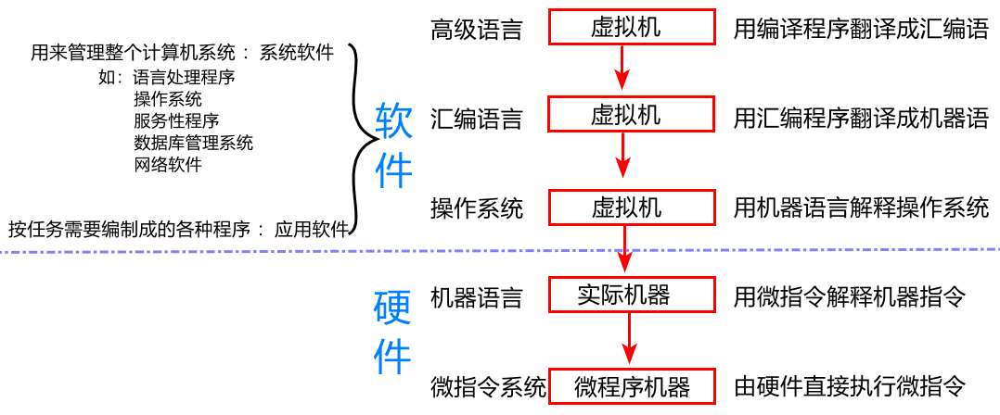
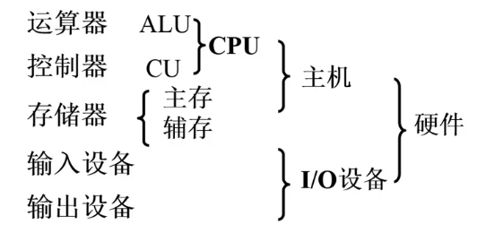

#  计算机组成原理

##  一、计算机系统概述

### 1、现代计算机的多态性

- 把感应器嵌入和装备到电网、铁路、桥梁、隧道、公路、建筑、供水系统、大坝、油气管道等各种物体中，并且被普遍连接，形成所谓“物联网”，然后将“物联网”与现有的互联网整合起来，实现人类社会与物理系统的整合，形成智慧地球

### 2、冯诺依曼型计算机特点

* 1.计算机由运算器，控制器，存储器，输入和输出设备5部分组成
* 2.采用存储程序的方式，程序和数据放在同一个存储器中，并以二进制表示。
* 3.指令由操作码和地址码组成
* 4.指令在存储器中按执行顺序存放，由指令计数器(即程序计数器PC)指明要执行的指令所在的储存单元地址，一般按顺序递增，但可按运算结果或外界条件而改变
* 5.机器以运算器为中心，输入输出设备与存储器间的数据传送都通过运算器

### 3、计算机系统的层次结构

- 

### 4、计算机硬件框图

- 

### 5、区别以运算器为中心的计算机还是存储器的方法

- 看输入设备能否直接与存储器相连，是的话就是以存储器为中心

## 二、系统总线

### 1、总线的基本概念

- 总线是连接各个部件的信息传输线，是 各个部件共享的传输介质

### 2、总线的分类

1. 片内总线：芯片内部 的总线
2. 系统总线：计算机各部件之间 的信息传输线
   - 数据总线——双向传输 与机器字长、存储字长有关
   - 地址总线——单向传输 与存储地址、 I/O地址有关
   - 控制总线——有出 有入  发出控制信号 监控不同组件间的状态
3. 通信总线：用于 计算机系统之间 或 计算机系统与其他系统（如控制仪表、移动通信等）之间的通信
   - 传输方式：串行通信总线和并行通信总线

### 3、总线标准

### 4、总线判优控制（总线仲裁）

- #### 1. 概念

  - 集中式
    - 链式查询
    - 计数器定时查询
    - 独立请求方式
  - 分布式

- #### 2.链式查询方式

  - 好处：电路复杂度低，仲裁方式简单
  - 坏处：优先级低的设备难以获得总线使用权  对电路故障敏感

- #### 3.计数器定时查询方式

  - 

- #### 4.独立请求方式
