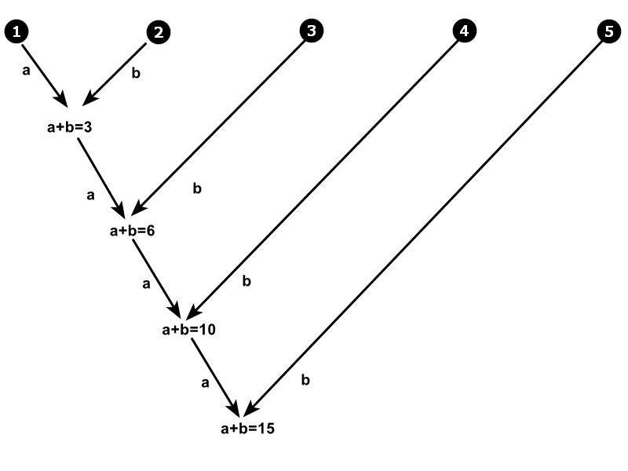

# reduceByKey  按相同的key分组，value相加

##官网
| Scala | 翻译  | python | 翻译  |
|-------|-----|--------|-----|
|When called on a dataset of (K, V) pairs, returns a dataset of (K, V) pairs where the values for each key are aggregated using the given reduce function func, which must be of type (V,V) => V. Like in groupByKey, the number of reduce tasks is configurable through an optional second argument.|在 （K， V） 对的数据集上调用时，返回 （K， V） 对的数据集，其中每个键的值使用给定的 reduce 函数函数函数进行聚合，该函数函数的类型必须是 （V，V） => V。与在 groupByKey 中一样，减少任务的数量可以通过可选的第二个参数进行配置。|Merge the values for each key using an associative and commutative reduce function.|使用关联和交换归约函数合并每个键的值。|

 

---

 

## 聚合逻辑

